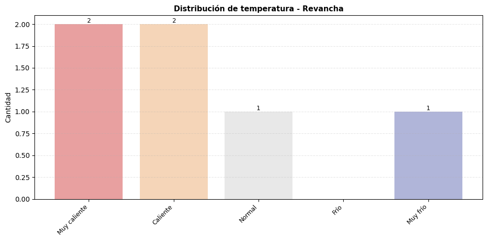
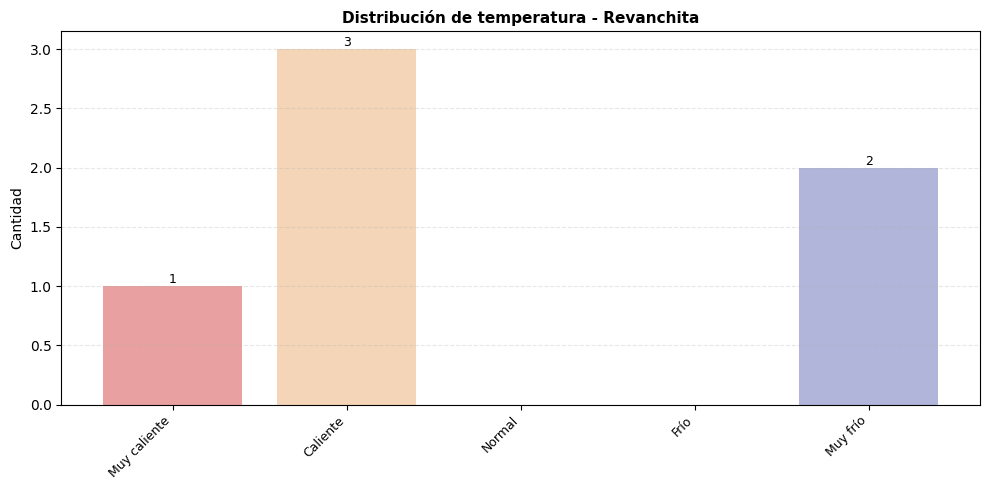

# 📊 Análisis de Lotería Melate

**Fecha del análisis**: 21/11/2025 17:14:51

📚 **[Leer Metodología y Fundamentos Estadísticos](https://mariotristan.github.io/melate/METODOLOGIA)** - Comprende los fundamentos teóricos, estrategias y limitaciones del análisis.

---

## 📂 Información de Archivos de Datos

| Archivo | Última Actualización | Sorteos |
|:-------:|:--------------------:|:-------:|
| 🎱 Melate.csv | 21/11/2025 17:14:46 | 4,137 |
| 🔄 Revancha.csv | 21/11/2025 17:14:48 | 3,129 |
| ⭐ Revanchita.csv | 21/11/2025 17:14:49 | 1,767 |

---

## 📈 Resumen General

- **Total de sorteos analizados**: 9,033
  - 🎱 Melate: 4,137
  - 🔄 Revancha: 3,129
  - ⭐ Revanchita: 1,767

---

## 🎱 Top 20 Números Más Frecuentes

| Pos | Número | Frecuencia | % Sorteos | Desviación | Estado |
|:---:|:------:|:----------:|:---------:|:----------:|:------:|
| 1 | **24** | 1120 | 12.4% | +15.7% | 🔥 Muy caliente |
| 2 | **32** | 1097 | 12.1% | +13.3% | 🔥 Muy caliente |
| 3 | **5** | 1090 | 12.1% | +12.6% | 🔥 Muy caliente |
| 4 | **29** | 1088 | 12.0% | +12.4% | 🔥 Muy caliente |
| 5 | **30** | 1086 | 12.0% | +12.2% | 🔥 Muy caliente |
| 6 | **13** | 1086 | 12.0% | +12.2% | 🔥 Muy caliente |
| 7 | **2** | 1084 | 12.0% | +12.0% | 🔥 Muy caliente |
| 8 | **15** | 1076 | 11.9% | +11.2% | 🔥 Muy caliente |
| 9 | **1** | 1074 | 11.9% | +11.0% | 🔥 Muy caliente |
| 10 | **36** | 1072 | 11.9% | +10.8% | 🔥 Muy caliente |
| 11 | **18** | 1065 | 11.8% | +10.0% | 🔥 Muy caliente |
| 12 | **28** | 1065 | 11.8% | +10.0% | 🔥 Muy caliente |
| 13 | **7** | 1064 | 11.8% | +9.9% | 🌡️ Caliente |
| 14 | **3** | 1062 | 11.8% | +9.7% | 🌡️ Caliente |
| 15 | **14** | 1060 | 11.7% | +9.5% | 🌡️ Caliente |
| 16 | **35** | 1059 | 11.7% | +9.4% | 🌡️ Caliente |
| 17 | **17** | 1058 | 11.7% | +9.3% | 🌡️ Caliente |
| 18 | **33** | 1058 | 11.7% | +9.3% | 🌡️ Caliente |
| 19 | **19** | 1056 | 11.7% | +9.1% | 🌡️ Caliente |
| 20 | **37** | 1055 | 11.7% | +9.0% | 🌡️ Caliente |
---

## 🤔 Recomendación de Estrategia según Tendencia de Calor

**Tendencia observada:** El último sorteo fue mixto.

**Recomendación:** La estrategia **balanceada** es la más robusta, pero puedes probar también la **serendipity** para diversificar.

**Razonamiento:** En escenarios mixtos, el equilibrio y la aleatoriedad controlada suelen ser óptimos.---

## ⚠️ Disclaimer

> Este análisis es con fines educativos y estadísticos únicamente. Los sorteos de lotería son eventos aleatorios y los resultados pasados NO garantizan resultados futuros. Juega responsablemente.

---

*Generado automáticamente el 21/11/2025 a las 17:14:51*
## 🌡️ Indicador de Calor - Últimos Resultados

Esta sección compara los números del último sorteo de cada lotería contra las categorías de temperatura (caliente/frío) basadas en su frecuencia histórica.

### 🎰 Melate - Sorteo del 19/11/2025

| Número | Frecuencia | Desviación | Estado |
|:------:|:----------:|:----------:|:------:|
| **6** | 1037 | +7.1% | 🌡️ Caliente |
| **12** | 1046 | +8.1% | 🌡️ Caliente |
| **30** | 1086 | +12.2% | 🔥 Muy caliente |
| **42** | 979 | +1.2% | ➡️ Normal |
| **45** | 764 | -21.1% | 🧊 Muy frío |
| **53** | 624 | -35.5% | 🧊 Muy frío |

**📊 Distribución de temperatura:**
- 🔥 Muy calientes: 1
- 🌡️ Calientes: 2
- ➡️ Normales: 1
- ❄️ Fríos: 0
- 🧊 Muy fríos: 2

### 🎰 Revancha - Sorteo del 19/11/2025

| Número | Frecuencia | Desviación | Estado |
|:------:|:----------:|:----------:|:------:|
| **10** | 1052 | +8.7% | 🌡️ Caliente |
| **25** | 1052 | +8.7% | 🌡️ Caliente |
| **33** | 1058 | +9.3% | 🌡️ Caliente |
| **38** | 1025 | +5.9% | 🌡️ Caliente |
| **39** | 1046 | +8.1% | 🌡️ Caliente |
| **43** | 993 | +2.6% | ➡️ Normal |

**📊 Distribución de temperatura:**
- 🔥 Muy calientes: 0
- 🌡️ Calientes: 5
- ➡️ Normales: 1
- ❄️ Fríos: 0
- 🧊 Muy fríos: 0

### 🎰 Revanchita - Sorteo del 19/11/2025

| Número | Frecuencia | Desviación | Estado |
|:------:|:----------:|:----------:|:------:|
| **2** | 1084 | +12.0% | 🔥 Muy caliente |
| **3** | 1062 | +9.7% | 🌡️ Caliente |
| **10** | 1052 | +8.7% | 🌡️ Caliente |
| **18** | 1065 | +10.0% | 🔥 Muy caliente |
| **28** | 1065 | +10.0% | 🔥 Muy caliente |
| **54** | 663 | -31.5% | 🧊 Muy frío |

**📊 Distribución de temperatura:**
- 🔥 Muy calientes: 3
- 🌡️ Calientes: 2
- ➡️ Normales: 0
- ❄️ Fríos: 0
- 🧊 Muy fríos: 1

---

## 👥 Top 10 Pares Más Comunes

| Posición | Par | Frecuencia |
|:--------:|:---:|:----------:|
| 1 | (24, 28) | 152 veces |
| 2 | (1, 5) | 143 veces |
| 3 | (13, 22) | 142 veces |
| 4 | (5, 15) | 140 veces |
| 5 | (15, 17) | 138 veces |
| 6 | (24, 32) | 136 veces |
| 7 | (13, 14) | 133 veces |
| 8 | (24, 38) | 131 veces |
| 9 | (18, 20) | 130 veces |
| 10 | (1, 15) | 129 veces |

---

## 🎯 Top 10 Tríadas Más Comunes

| Posición | Tríada | Frecuencia |
|:--------:|:------:|:----------:|
| 1 | (16, 24, 28) | 25 veces |
| 2 | (4, 33, 39) | 22 veces |
| 3 | (1, 5, 15) | 22 veces |
| 4 | (12, 35, 39) | 22 veces |
| 5 | (23, 25, 32) | 21 veces |
| 6 | (1, 5, 10) | 21 veces |
| 7 | (3, 37, 40) | 21 veces |
| 8 | (5, 31, 32) | 20 veces |
| 9 | (7, 29, 33) | 20 veces |
| 10 | (5, 15, 17) | 20 veces |

---

## 🎪 Top 10 Cuartetos Más Comunes

| Posición | Cuarteto | Frecuencia |
|:--------:|:--------:|:----------:|
| 1 | (11, 16, 19, 25) | 6 veces |
| 2 | (18, 24, 32, 42) | 6 veces |
| 3 | (10, 18, 26, 39) | 6 veces |
| 4 | (10, 13, 22, 35) | 6 veces |
| 5 | (10, 24, 28, 55) | 5 veces |
| 6 | (4, 11, 29, 30) | 5 veces |
| 7 | (27, 31, 33, 39) | 5 veces |
| 8 | (13, 32, 33, 40) | 5 veces |
| 9 | (13, 22, 28, 34) | 5 veces |
| 10 | (3, 22, 27, 29) | 5 veces |

---

## 🌟 Top 10 Quintetos Más Comunes

| Posición | Quinteto | Frecuencia |
|:--------:|:--------:|:----------:|
| 1 | (16, 20, 24, 28, 44) | 3 veces |
| 2 | (17, 18, 24, 32, 42) | 3 veces |
| 3 | (7, 8, 20, 24, 32) | 3 veces |
| 4 | (11, 13, 19, 25, 28) | 3 veces |
| 5 | (18, 39, 41, 45, 46) | 2 veces |
| 6 | (2, 3, 34, 48, 55) | 2 veces |
| 7 | (8, 12, 15, 18, 20) | 2 veces |
| 8 | (8, 12, 15, 18, 34) | 2 veces |
| 9 | (8, 12, 15, 20, 34) | 2 veces |
| 10 | (8, 12, 18, 20, 34) | 2 veces |

---

## 🔄 Combinaciones Completas Repetidas

| Combinación Completa | Frecuencia |
|:--------------------:|:----------:|
| (8, 12, 15, 18, 20, 34) | 2 veces |
| (11, 16, 19, 22, 25, 47) | 2 veces |
| (5, 11, 14, 38, 40, 41) | 2 veces |
| (5, 7, 18, 26, 28, 33) | 2 veces |
| (7, 18, 23, 27, 45, 54) | 2 veces |

---

## 🎲 Recomendaciones del Día (21/11/2025)

### 📊 Cinco Estrategias Diferentes

Todas las recomendaciones usan la fecha actual como semilla para generar combinaciones consistentes y reproducibles.

#### 📋 Estrategia 1: HÍBRIDA (4 calientes + 2 aleatorios)

Combina números de alta frecuencia con selección aleatoria para diversificar el riesgo.

| # | Combinación |
|:-:|:-----------|
| 1 | **03 - 14 - 25 - 28 - 44 - 51** |
| 2 | **02 - 07 - 17 - 24 - 30 - 32** |
| 3 | **13 - 21 - 24 - 29 - 31 - 37** |
| 4 | **14 - 16 - 28 - 36 - 37 - 42** |
| 5 | **02 - 12 - 16 - 18 - 20 - 33** |

#### 🔥 Estrategia 2: CONSERVADORA (solo números calientes)

Apuesta exclusivamente por los números más frecuentes históricamente.

| # | Combinación |
|:-:|:-----------|
| 1 | **01 - 13 - 19 - 24 - 32 - 33** |
| 2 | **01 - 07 - 19 - 29 - 32 - 37** |
| 3 | **02 - 14 - 15 - 24 - 33 - 37** |
| 4 | **02 - 07 - 14 - 24 - 32 - 37** |
| 5 | **05 - 07 - 17 - 18 - 24 - 37** |

#### 🧊 Estrategia 3: CONTRARIAN (números fríos)

Apuesta a la reversión: números que han salido menos podrían "compensar" estadísticamente.

| # | Combinación |
|:-:|:-----------|
| 1 | **41 - 46 - 47 - 49 - 51 - 52** |
| 2 | **44 - 46 - 50 - 52 - 54 - 55** |
| 3 | **42 - 46 - 52 - 53 - 54 - 56** |
| 4 | **42 - 47 - 50 - 51 - 55 - 56** |
| 5 | **41 - 42 - 44 - 53 - 54 - 55** |

#### ⚖️ Estrategia 4: BALANCEADA (3 calientes + 3 fríos)

Equilibrio perfecto entre números frecuentes y poco frecuentes.

| # | Combinación |
|:-:|:-----------|
| 1 | **13 - 28 - 30 - 45 - 46 - 51** |
| 2 | **03 - 24 - 32 - 45 - 49 - 50** |
| 3 | **13 - 29 - 36 - 48 - 50 - 52** |
| 4 | **05 - 14 - 29 - 53 - 55 - 56** |
| 5 | **18 - 29 - 36 - 45 - 46 - 51** |

#### ✨ Estrategia 5: SERENDIPITY (mezcla de todas)

Cada combinación usa aleatoriamente una de las 4 estrategias anteriores. ¡Deja que el destino elija!

| # | Estrategia | Combinación |
|:-:|:----------:|:-----------|
| 1 | ⚖️ Balanceada | **01 - 07 - 13 - 49 - 51 - 55** |
| 2 | 🧊 Contrarian | **41 - 45 - 46 - 47 - 48 - 53** |
| 3 | 🧊 Contrarian | **42 - 48 - 52 - 53 - 54 - 56** |
| 4 | 🔥 Conservadora | **02 - 03 - 05 - 07 - 15 - 29** |
| 5 | 🔥 Conservadora | **01 - 07 - 18 - 28 - 35 - 37** |

---

## ⚠️ Disclaimer

> Este análisis es con fines educativos y estadísticos únicamente. Los sorteos de lotería son eventos aleatorios y los resultados pasados NO garantizan resultados futuros. Juega responsablemente.

---

*Generado automáticamente el 21/11/2025 a las 17:14:51*
