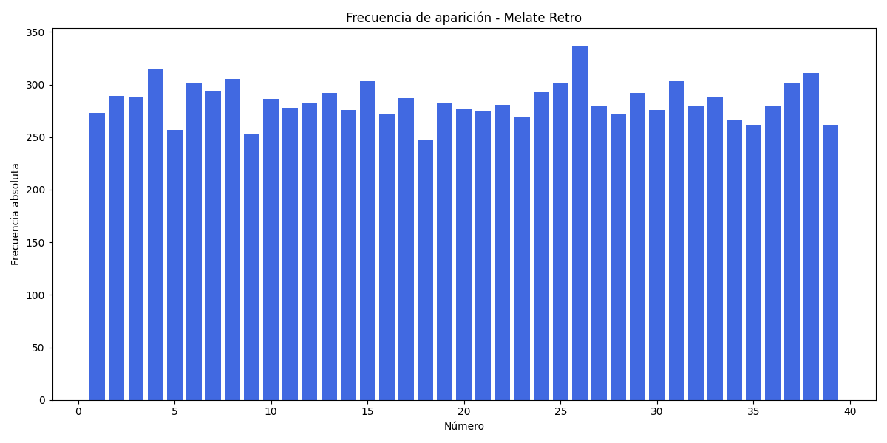

# 📊 Análisis Estadístico Melate Retro

**Fecha de análisis:** 2025-11-23 05:49:34

- Sorteos analizados: 1583
- Números posibles: 39

## Frecuencia absoluta por número

## Desviación porcentual y calor

| Número | Frecuencia | Desviación (%) | Calor |
|--------|------------|---------------|-------|
| 1 | 273 | -3.92 | ➡️ Normal |
| 2 | 289 | 1.71 | ➡️ Normal |
| 3 | 288 | 1.36 | ➡️ Normal |
| 4 | 315 | 10.87 | 🔥 Muy caliente |
| 5 | 257 | -9.55 | ❄️ Frío |
| 6 | 301 | 5.94 | 🌡️ Caliente |
| 7 | 294 | 3.47 | ➡️ Normal |
| 8 | 305 | 7.35 | 🌡️ Caliente |
| 9 | 253 | -10.96 | 🧊 Muy frío |
| 10 | 286 | 0.66 | ➡️ Normal |
| 11 | 278 | -2.16 | ➡️ Normal |
| 12 | 283 | -0.40 | ➡️ Normal |
| 13 | 292 | 2.77 | ➡️ Normal |
| 14 | 276 | -2.86 | ➡️ Normal |
| 15 | 303 | 6.64 | 🌡️ Caliente |
| 16 | 271 | -4.62 | ➡️ Normal |
| 17 | 287 | 1.01 | ➡️ Normal |
| 18 | 247 | -13.07 | 🧊 Muy frío |
| 19 | 282 | -0.75 | ➡️ Normal |
| 20 | 276 | -2.86 | ➡️ Normal |
| 21 | 275 | -3.21 | ➡️ Normal |
| 22 | 281 | -1.10 | ➡️ Normal |
| 23 | 268 | -5.68 | ❄️ Frío |
| 24 | 293 | 3.12 | ➡️ Normal |
| 25 | 302 | 6.29 | 🌡️ Caliente |
| 26 | 337 | 18.61 | 🔥 Muy caliente |
| 27 | 279 | -1.80 | ➡️ Normal |
| 28 | 272 | -4.27 | ➡️ Normal |
| 29 | 291 | 2.42 | ➡️ Normal |
| 30 | 276 | -2.86 | ➡️ Normal |
| 31 | 303 | 6.64 | 🌡️ Caliente |
| 32 | 280 | -1.45 | ➡️ Normal |
| 33 | 288 | 1.36 | ➡️ Normal |
| 34 | 266 | -6.38 | ❄️ Frío |
| 35 | 262 | -7.79 | ❄️ Frío |
| 36 | 278 | -2.16 | ➡️ Normal |
| 37 | 301 | 5.94 | 🌡️ Caliente |
| 38 | 311 | 9.46 | 🌡️ Caliente |
| 39 | 262 | -7.79 | ❄️ Frío |

---
## 🌡️ Indicador de Calor - Últimos Resultados

Esta sección compara los números del último sorteo contra las categorías de temperatura (caliente/frío) basadas en su frecuencia histórica.

### 🎰 Melate Retro - Sorteo más reciente (18/11/2025)

| Número | Frecuencia | Desviación (%) | Calor |
|:------:|:----------:|:--------------:|:------:|
| **3** | 288 | 1.36 | ➡️ Normal |
| **5** | 257 | -9.55 | ❄️ Frío |
| **7** | 294 | 3.47 | ➡️ Normal |
| **17** | 287 | 1.01 | ➡️ Normal |
| **21** | 275 | -3.21 | ➡️ Normal |
| **22** | 281 | -1.10 | ➡️ Normal |
| **9** | 253 | -10.96 | 🧊 Muy frío |

**📊 Distribución de temperatura:**
- 🔥 Muy calientes: 0
- 🌡️ Calientes: 0
- ➡️ Normales: 5
- ❄️ Fríos: 1
- 🧊 Muy fríos: 1

---
## 🎲 Recomendaciones del Día

### 📊 Cinco Estrategias Diferentes

Todas las recomendaciones usan la fecha actual como semilla para generar combinaciones consistentes y reproducibles.

#### 📋 Estrategia 1: HÍBRIDA (4 calientes + 2 aleatorios)

Combina números de alta frecuencia con selección aleatoria para diversificar el riesgo.

| # | Combinación |
|:-:|:-----------|
| 1 | **05 - 11 - 13 - 17 - 22 - 24** |
| 2 | **03 - 04 - 06 - 21 - 23 - 27** |
| 3 | **03 - 04 - 11 - 12 - 13 - 34** |
| 4 | **12 - 15 - 17 - 24 - 30 - 31** |
| 5 | **20 - 25 - 28 - 31 - 32 - 34** |

#### 🔥 Estrategia 2: CONSERVADORA (solo números calientes)

Apuesta exclusivamente por los números más frecuentes históricamente.

| # | Combinación |
|:-:|:-----------|
| 1 | **12 - 15 - 24 - 25 - 26 - 38** |
| 2 | **03 - 07 - 12 - 19 - 25 - 37** |
| 3 | **02 - 06 - 10 - 26 - 31 - 37** |
| 4 | **08 - 12 - 15 - 17 - 19 - 37** |
| 5 | **02 - 08 - 15 - 19 - 29 - 38** |

#### 🧊 Estrategia 3: CONTRARIAN (números fríos)

Apuesta a la reversión: números que han salido menos podrían 'compensar' estadísticamente.

| # | Combinación |
|:-:|:-----------|
| 1 | **14 - 20 - 21 - 34 - 35 - 36** |
| 2 | **09 - 16 - 21 - 23 - 28 - 39** |
| 3 | **05 - 14 - 16 - 20 - 30 - 36** |
| 4 | **14 - 16 - 20 - 23 - 35 - 36** |
| 5 | **09 - 16 - 18 - 28 - 35 - 36** |

#### ⚖️ Estrategia 4: BALANCEADA (3 calientes + 3 fríos)

Equilibrio perfecto entre números frecuentes y poco frecuentes.

| # | Combinación |
|:-:|:-----------|
| 1 | **01 - 04 - 07 - 08 - 09 - 16** |
| 2 | **03 - 04 - 05 - 23 - 35 - 38** |
| 3 | **02 - 05 - 06 - 26 - 28 - 39** |
| 4 | **04 - 06 - 08 - 16 - 18 - 23** |
| 5 | **03 - 18 - 21 - 24 - 25 - 35** |

#### ✨ Estrategia 5: SERENDIPITY (mezcla de todas)

Cada combinación usa aleatoriamente una de las 4 estrategias anteriores. ¡Deja que el destino elija!

| # | Estrategia | Combinación |
|:-:|:----------:|:-----------|
| 1 | ⚖️ Balanceada | **01 - 25 - 28 - 34 - 37 - 38** |
| 2 | 📋 Híbrida | **08 - 15 - 17 - 22 - 30 - 33** |
| 3 | 📋 Híbrida | **01 - 19 - 22 - 25 - 32 - 38** |
| 4 | ⚖️ Balanceada | **05 - 06 - 09 - 24 - 28 - 37** |
| 5 | 📋 Híbrida | **04 - 17 - 18 - 31 - 32 - 37** |

---
## ⚠️ Disclaimer

> Este análisis es con fines educativos y estadísticos únicamente. Los sorteos de lotería son eventos aleatorios y los resultados pasados NO garantizan resultados futuros. Juega responsablemente.

---

*Generado automáticamente el 23/11/2025 a las 05:49:34*
