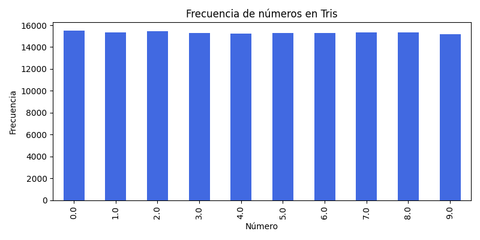

# 📊 Análisis Estadístico de Tris

 **Fecha de análisis:**  2025-11-25 07:25

- Sorteos analizados: 32249
- Números posibles: 10 (0-9)

---

**¿Qué es Tris?**

Tris es el sorteo numérico más accesible de México, donde puedes decidir cuánto quieres ganar según la modalidad que elijas y cuánto desees apostar. Puedes jugar desde $1 peso, seleccionando 1, 2, 3, 4 o 5 dígitos, cada uno de un conjunto diferente de esferas del 0 al 9.

Las urnas de Tris eligen 5 números al azar para formar una cifra de 5 dígitos. Si tus números coinciden en estricto orden con los del sorteo, ¡puedes ganar muchísimo dinero! Dependiendo de la modalidad, tu oportunidad de ganar más dinero puede aumentar.

---

## Tabla de Frecuencias

| Número | Frecuencia | Porcentaje (%) | Desviación (%) | Calor |
|:------:|:----------:|:--------------:|:--------------:|:------:|
| 0 | 15475 | 9.60 | -4.03 | ➡️ Normal |
| 1 | 15359 | 9.53 | -4.75 | ➡️ Normal |
| 2 | 15425 | 9.57 | -4.34 | ➡️ Normal |
| 3 | 15254 | 9.46 | -5.40 | ➡️ Normal |
| 4 | 15225 | 9.44 | -5.58 | ➡️ Normal |
| 5 | 15276 | 9.47 | -5.26 | ➡️ Normal |
| 6 | 15300 | 9.49 | -5.11 | ➡️ Normal |
| 7 | 15333 | 9.51 | -4.91 | ➡️ Normal |
| 8 | 15332 | 9.51 | -4.91 | ➡️ Normal |
| 9 | 15147 | 9.39 | -6.06 | ➡️ Normal |

## 🌡️ Indicador de Calor - Últimos Resultados

### 🎰 Tris - Sorteo más reciente (23/11/2025)

| Número | Frecuencia | Desviación (%) | Calor |
|:------:|:----------:|:--------------:|:------:|
| **8** | 15332 | -4.91 | ➡️ Normal |
| **8** | 15332 | -4.91 | ➡️ Normal |
| **2** | 15425 | -4.34 | ➡️ Normal |
| **0** | 15475 | -4.03 | ➡️ Normal |
| **2** | 15425 | -4.34 | ➡️ Normal |

**📊 Distribución de temperatura:**

- 🔥 Muy calientes: 0
- 🌡️ Calientes: 0
- ➡️ Normales: 5
- ❄️ Fríos: 0
- 🧊 Muy fríos: 0

## 🤔 Recomendación de Estrategia según Tendencia de Calor

**Tendencia observada:** El último sorteo fue equilibrado, con mayoría de números normales.

**Recomendación:** La estrategia balanceada o híbrida es la más sensata, ya que no hay una tendencia clara.

**Razonamiento:** Cuando no hay predominio de calientes ni fríos, conviene diversificar y equilibrar el riesgo.

---

## 🎲 Recomendaciones del Día

_Generadas el 25/11/2025 07:25 con semilla aleatoria 20251125_

**Estrategia 1: Híbrida (3 calientes + 2 aleatorios)**

- Combinación 1: [1, 2, 4, 6, 9]
- Combinación 2: [1, 2, 3, 6, 7]
- Combinación 3: [1, 2, 6, 8, 9]
- Combinación 4: [1, 2, 5, 8, 9]
- Combinación 5: [1, 2, 4, 6, 9]

**Estrategia 2: Conservadora (solo calientes)**

- Combinación 1: [1, 4, 6, 7, 8]
- Combinación 2: [0, 3, 4, 5, 9]
- Combinación 3: [0, 1, 2, 8, 9]
- Combinación 4: [1, 2, 4, 5, 7]
- Combinación 5: [2, 6, 7, 8, 9]

**Estrategia 3: Contrarian (solo fríos)**

- Combinación 1: [0, 3, 4, 5, 7]
- Combinación 2: [0, 3, 4, 5, 8]
- Combinación 3: [2, 4, 5, 7, 9]
- Combinación 4: [2, 4, 6, 8, 9]
- Combinación 5: [1, 4, 7, 8, 9]

**Estrategia 4: Balanceada (2 calientes + 2 fríos + 1 normal)**

- Combinación 1: [0, 1, 3, 5, 9]
- Combinación 2: [1, 5, 7, 8, 9]
- Combinación 3: [0, 1, 2, 5, 6]
- Combinación 4: [3, 6, 7, 8, 9]
- Combinación 5: [1, 3, 4, 8, 9]

**Estrategia 5: Serendipity (mezcla aleatoria)**

- Combinación 1: [2, 3, 5, 6, 9]
- Combinación 2: [3, 4, 5, 6, 8]
- Combinación 3: [0, 3, 4, 8, 9]
- Combinación 4: [0, 1, 3, 5, 9]
- Combinación 5: [0, 3, 5, 8, 9]

## ⚠️ Disclaimer

Este análisis es meramente estadístico y no garantiza resultados. Juega responsablemente.
